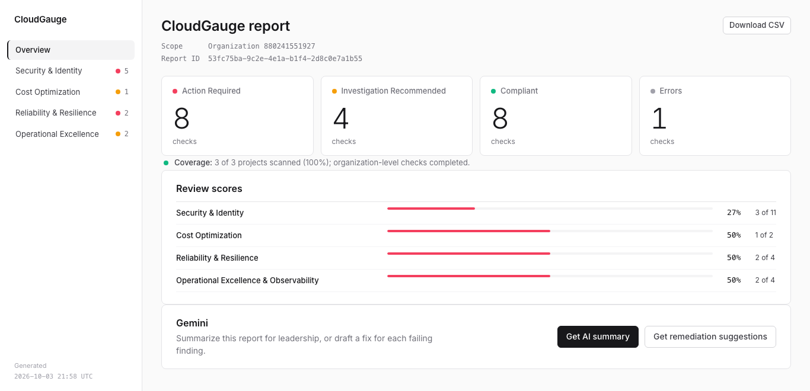
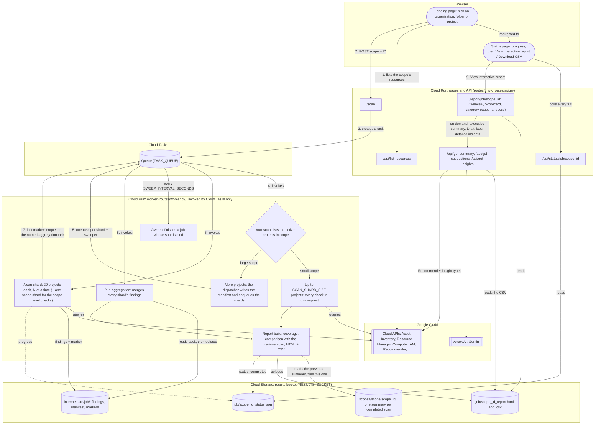
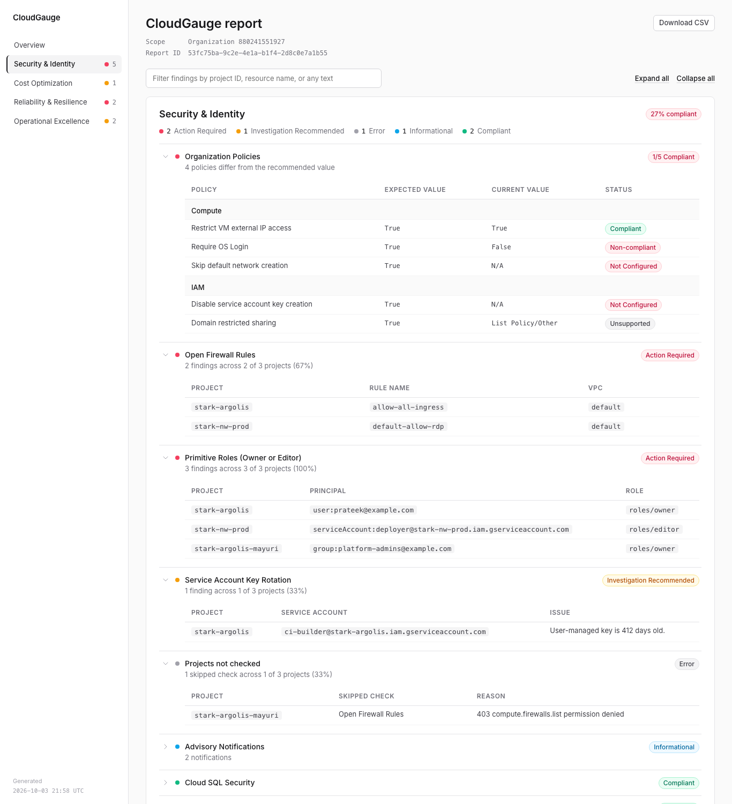
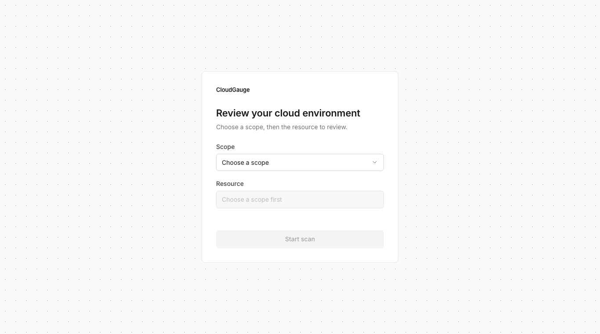
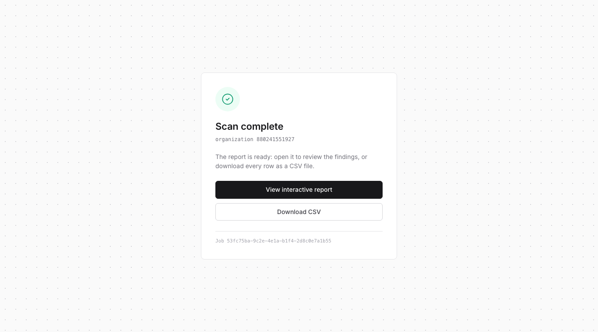

[](LICENSE)

# **CloudGauge**

**Note:** This is not an officially supported Google product. This project is not eligible for the [Google Open Source Software Vulnerability Rewards Program](https://bughunters.google.com/open-source-security).

CloudGauge is a web application designed to run a comprehensive set of compliance, security, cost optimization, and best-practice checks against a Google Cloud **organization, folder or project**.

It is built with Python/Flask, structured as a modular application package (Flask *application factory*), and deployed as a serverless application on **Google Cloud Run**. The application leverages **Cloud Tasks** to run scans asynchronously — a large organization is split into shards that run in parallel — ensuring that even very large organizations can be scanned without browser timeouts.

Final results are delivered as an interactive **HTML report** (an Overview, a one-page **Scorecard**, and a page per category) and a **CSV file**, stored in a Google Cloud Storage bucket and compared with the previous scan of the same scope. The reports also feature **Gemini-powered** executive summaries and `gcloud` remediation suggestions.




## **Table of Contents**

* [Features](#features)
* [Architecture](#architecture)
  * [Project Structure](#project-structure)
* [Deployment Instructions](#deployment-instructions)
  * [Common Prerequisites (Required for all methods)](#common-prerequisites-required-for-all-methods)
  * [Method 1: Deploy from Source (Recommended)](#method-1-deploy-from-source-recommended)
  * [Method 2: Manual Build & Deploy via gcloud](#method-2-manual-build--deploy-via-gcloud)
* [Configuration Reference](#configuration-reference)
* [Updating an Existing Deployment (Zero-Downtime)](#updating-an-existing-deployment-zero-downtime)
* [How to Use](#how-to-use)
* [Local Development & Testing](#local-development--testing)
* [Load Testing with a Synthetic Organization](#load-testing-with-a-synthetic-organization)
* [Troubleshooting](#troubleshooting)
* [Cleanup Script](#cleanup-script)
* [Release Notes & Roadmap](./RELEASE_NOTES.md)
* [License & Support](#license--support)

## **Features**

CloudGauge scans an organization, a folder or a project across several key domains, modeled after the Google Cloud Architecture Framework. Items marked *(organization scans)* describe the organization itself or query an organization-level API, so they run in an organization scan only; everything else runs in all three scopes, for the projects in scope.

### **Security & Identity**

* **Organization Policies**: Checks boolean policies against a list of best practices. The policies are the scope's *effective* ones: for a folder or project scan the check walks the hierarchy from the organization down to the scanned resource, the nearest policy winning (a folder's over the organization's, a project's over both). It runs even for a folder that holds no project.
* **Organization IAM** *(organization scans)*: Scans for public principals (`allUsers`, `allAuthenticatedUsers`) and primitive roles (`owner`, `orgAdmin`) at the org level.
* **Project IAM**: Scans all projects for the use of primitive `roles/owner` and `roles/editor`.
* **Security Command Center** *(organization scans)*: Verifies that SCC Premium is enabled.
* **SA Key Rotation**: Finds user-managed service account keys older than 90 days.
* **Public GCS Buckets**: Detects GCS buckets that are publicly accessible.
* **Open Firewall Rules**: Scans all VPCs for firewall rules open to the internet (`0.0.0.0/0`).
* **Cloud SQL Security**: Flags Cloud SQL instances with a public IP or without SSL enforcement.
* **VPC Configuration**: Detects projects still using the `default` VPC network and subnets without Private Google Access.
* **GCS Uniform Bucket-Level Access**: Finds buckets without Uniform Bucket-Level Access (UBLA) enabled.
* **VM External IPs**: Finds VM instances with external IP addresses.
* **Advisory Notifications** *(briefing)*: Lists Google's Mandatory Service Announcements, Security & Privacy Advisories, Threat Horizons reports and sensitive-action digests for the scanned scope (the organization, or each project of a folder/project scan) from the last 365 days, one table with a `Type` column, affected resources and (for digests) the actions and actors. Always *Informational*: these are Google's messages, not the customer's posture.
* **Advisory Notifications Settings**: Flags a scope in which a notification type is turned off (*Action Required*), and reports when the scanner cannot read the notifications or the settings (*Error*; see the [prerequisites](#common-prerequisites-required-for-all-methods)).

### **Cost Optimization**

* **Idle Resources**: Finds idle Cloud SQL instances, VMs, persistent disks, and unassociated IP addresses.
* **Rightsizing**: Identifies overprovisioned VMs and underutilized reservations.
* **Detailed insights** *(on demand)*: The Cost Optimization page's **Get detailed insights** button asks the Recommender's insight types for every project in scope — CPU and memory usage, idle images, and more — and renders them in the page without re-running the scan.

### **Reliability & Resilience**

* **Essential Contacts** *(organization scans)*: Ensures a contact is subscribed to the `SECURITY`, `TECHNICAL`, `LEGAL` and `SUSPENSION` categories (a contact subscribed to `ALL` covers them all).
* **Service Health Incidents** *(briefing)*: The Google Cloud incidents that were *Impacted* or *Related* to the scanned projects in the last 90 days, from Personalized Service Health, one row per incident naming every project it touched (active incidents first). Always *Informational*. The relevance and window are configurable (`SERVICE_HEALTH_RELEVANCE`, `SERVICE_HEALTH_WINDOW_DAYS`).
* **Personalized Service Health API Coverage**: Flags every project in which the Service Health API is not enabled (*Action Required*): such a project has no personalized incident view, alerts or relevance.
* **Cloud SQL Resilience**: Checks every Cloud SQL instance under the scanned organization, folder or project (Cloud Asset Inventory) for High Availability (HA) configuration, automated backups, backup retention (at least 30) and Point-in-Time Recovery (PITR). Each of the four checks reaches a verdict: *Action Required* with the instances, or *Compliant* with an all-clear row.
* **GCS Versioning**: Finds buckets without object versioning enabled.
* **GKE Hygiene**: Checks for clusters not on a release channel and node pools with auto-upgrade disabled.
* **GKE Supported Versions**: Finds control planes and node pools on a GKE minor that is no longer offered (*Action Required*) or on the oldest minor still offered — the next to leave support (*Investigation Recommended*). The reference is GKE's own `getServerConfig` for the cluster's location: a cluster on a release channel is judged against its channel's versions, one without against the static lists. Every row carries the `gcloud container clusters upgrade` command to the right target (a node pool never beyond its control plane).
* **Resilience Assets**: Identifies zonal MIGs (recommends regional) and single-region disk snapshots, named one by one with their location, under the scanned scope; an all-clear row when there are none.

### **Operational Excellence & Observability**

* **Audit Logging** *(organization scans)*: Checks for an organization-level log sink.
* **OS Config Coverage**: Identifies running VMs (excluding GKE/Dataproc) that are not reporting to the OS Config service.
* **Monitoring Coverage**: Scans for projects missing key alert policies (e.g., Quota, Cloud SQL, GKE).
* **Network Analyzer**: Ingests and normalizes insights for VPC, GKE, and PSA IP address utilization.
* **Standalone VMs**: Finds VMs not managed by a Managed Instance Group (MIG).
* **Quota Utilization**: Identifies any regional compute quotas exceeding 80% utilization.
* **Firewall Complexity**: Flags projects whose VPC firewall rule count suggests a review (*Investigation Recommended*).
* **Recent Changes** *(briefing)*: The Recommender's recent-change insights for each project, and for the organization in an organization scan. *Informational*.
* **Unattended Projects** *(organization scans)*: Flags projects the Recommender reports as unattended (low utilization).

### **AI-Powered Insights (Gemini)**

* **Executive Summary & Remediation Suggestions**: Generated on demand from the report using Gemini on Vertex AI (via the `google-genai` SDK). The executive summary is generated and read on the report's **Scorecard** page, written for the people who will not open the category pages; remediation lives on the Overview and follows one rule: a check that knows its fix shows it under the finding itself; **Draft fixes** fills in the findings that have none, and marks what it adds as *AI-generated*. Every fix block, built-in or drafted, has a **Copy** button.
* **Automatic model selection**: By default (`GEMINI_MODEL=auto`) CloudGauge uses the newest stable Gemini Flash model available to your project, so it keeps working when older models are retired. Pin a specific model with the `GEMINI_MODEL` environment variable (see [Configuration Reference](#configuration-reference)).

##  **Architecture**

The application follows a robust, scalable, and asynchronous "fire-and-forget" pattern. This ensures the user gets an immediate response while the heavy work (which can take many minutes) is done in the background. The same flow serves a single project and an organization with thousands of projects; the difference is only in how the work is split behind the scenes. One Cloud Run service hosts all of it as three Flask blueprints: the **pages** (`app/routes/ui.py`), the **API** the pages call (`app/routes/api.py`), and the **worker** endpoints that only Cloud Tasks invokes (`app/routes/worker.py`).

1.  **Choosing the scope**: The landing page offers three scopes — **organization**, **folder** or **project**. Choosing one calls `/api/list-resources`, which lists the *active* folders or projects of the organization the service runs in (one Cloud Asset Inventory search); folders are named by their path and ID (`Engineering / Platform (4711)`), since folder names are unique only among siblings, projects by `Display name (project-id)`. The user picks one from the list.
2.  **Task creation**: The `/scan` endpoint creates a **Cloud Task** with the scope, its ID and a fresh job ID, and redirects the user to the status page.
3.  **Background worker**: Cloud Tasks securely invokes the `/run-scan` endpoint in the background. The worker lists the active projects in scope (Cloud Asset Inventory's recursive search; a folder scan also asks Resource Manager for the folder's direct children and reconciles the two lists, so a project moved in minutes ago is scanned too) and decides:
    * **Up to `SCAN_SHARD_SIZE` projects (default 20)**: it runs the whole scan in this one request.
    * **More projects**: it becomes a **dispatcher**. It writes the job's *manifest* (which projects belong to which shard), enqueues one `/scan-shard` task per shard of `SCAN_SHARD_SIZE` projects plus one **scope shard** for the checks that look at the scope itself (Organization Policies, Resilience of Critical Assets over the scope's Asset Inventory and, in an organization scan, org IAM, SCC, audit logging, Essential Contacts, the organization's Advisory Notifications), schedules a *sweeper*, and returns within seconds.
4.  **Parallel processing**: Each shard executes its checks concurrently using a thread pool (`app/checks/runner.py`) under a time budget (`SHARD_TIME_BUDGET_SECONDS`). Every finding is written to an intermediate file in GCS as soon as it is found. Cloud Tasks runs up to `SCAN_MAX_CONCURRENT_SHARDS` shards at a time and retries a failed shard; a shard that fails on its last attempt records its checks as error rows so one bad shard never costs the whole report.
5.  **Automatic fan-in**: When a shard finishes it writes a *marker* file. The shard that sees a marker for every shard enqueues the `/run-aggregation` task. The task name is deterministic (`<job>-aggregate`), so when two shards finish together Cloud Tasks accepts only one; nothing is counted, nothing needs a database. The `/sweep` task runs every `SWEEP_INTERVAL_SECONDS` as a safety net: it gives shards whose task has vanished error rows and finishes the job, so a scan always terminates.
6.  **Report build**: The single task, or the aggregation, reads the findings back (one item per check, with a **coverage** line stating how many projects were scanned), reads the **previous scan's summary** of the same scope from the bucket's `scopes/` prefix and compares the two (the report's *since* line and its deltas), renders the HTML and CSV reports, uploads them to Google Cloud Storage, files this scan's own summary under `scopes/` for the next scan to find, and deletes the intermediate files.
7.  **Status and report pages**: The status page polls `/api/status/<job>/<scope_id>` every few seconds; for a sharded scan it shows *"Scanned 640 of 1,000 projects · organization-level checks: completed"*. When the job completes it offers **View interactive report** (`/report/<job>/<scope_id>`, the HTML served from the bucket by the service) and **Download CSV** (a signed URL). The report's on-demand features call the API from its pages: the Scorecard's executive summary (`/api/get-summary`, Gemini over the CSV in the bucket), the Overview's **Draft fixes** (`/api/get-suggestions`, Gemini) and the Cost Optimization page's **Get detailed insights** (`/api/get-insights`, the Recommender's insight types). Shards are an implementation detail: everything the user reads (status page, coverage line, error rows) speaks of projects and organization-level checks.

### **Architecture Diagram**

The diagram below shows the whole flow: the pages and the API they call, the worker with the sharded path a large scope takes, the results bucket, and the report's on-demand features.



### **Scaling to Large Organizations**

A single request scanning 1,000 projects used to hang, run out of memory, or trip API quotas, and recovering meant a separate "aggregate" step. Sharding removes the ceiling without changing the user's workflow:

* **Bounded work per request.** A shard holds `SCAN_SHARD_SIZE` projects (default 20) and has `SHARD_TIME_BUDGET_SECONDS` (default 20 minutes) for its checks; checks that do not finish in time are reported as errors for that shard, the rest of the shard is kept. Each shard task has a 30-minute Cloud Tasks dispatch deadline, so set the Cloud Run request timeout to at least `1800` (the instructions use `3600`).
* **Bounded load on the APIs.** The queue created at startup allows `SCAN_MAX_CONCURRENT_SHARDS` (default 25) concurrent dispatches, 3 attempts per task, and 30 s–10 min back-off. If the queue already exists with different limits, the service logs a warning with the `gcloud tasks queues update ...` command to apply them (it never changes an existing queue by itself).
* **Spread across instances.** Deploy the service with a low request concurrency (the instructions use `--concurrency=4`) so that a burst of shards is spread over several Cloud Run instances instead of piling onto one.
* **Always terminates.** Markers in GCS plus deterministic task names make the fan-in exact and idempotent: retried or duplicated deliveries re-check the markers and never aggregate twice. A shard that crashes on every attempt is caught by the sweeper (`SWEEP_INTERVAL_SECONDS`), and the report is delivered with that shard's checks as error rows and an amber coverage line. A job that is still running at its **time limit** is finished with the results it has; the limit is sized per job (see below), so a large organization is never cut off while its shards are merely waiting in the queue. Partial reports are deliberate: an organization-wide report with 980 of 1,000 projects beats no report.
* **Same report.** The merged report is the one a single-task scan would have written for the same organization (the test suite verifies this against the synthetic organization), plus the coverage line.

The sizes can be tuned per deployment (see [Configuration Reference](#configuration-reference)); `tools/synthetic_scan.py --shard-size 20` rehearses the whole flow offline (see [Load Testing](#load-testing-with-a-synthetic-organization)).

#### Sizing for your organization

There is no cap on the number of projects: discovery pages through the whole organization, the job gets `ceil(projects / SCAN_SHARD_SIZE) + 1` shards, and the report's page size is bounded by the per-check row cap, not by the project count. What grows with the organization is the **duration** and the **API load**:

* **Duration.** The queue runs `SCAN_MAX_CONCURRENT_SHARDS` shards at a time, so a scan takes about `shards / SCAN_MAX_CONCURRENT_SHARDS × (time per shard)`. On the synthetic organization with 150 ms per API call a 20-project shard takes about 8 minutes; real shards vary with the projects' contents.
* **API load.** A project costs about 180 API calls (measured on the synthetic organization: three quarters of them Recommender `insights.list` / `recommendations.list`), so 25 concurrent shards with 15 check threads each can have a few hundred calls in flight. Compare that with the organization's quotas for the Recommender, Compute, Asset, and Monitoring APIs before raising `SCAN_MAX_CONCURRENT_SHARDS`; lower it if scans report `429` errors.
* **Time limit.** `max(6 h, 2 × ceil(shards / SCAN_MAX_CONCURRENT_SHARDS) × 30 min)`: twice the time the queue needs if every shard used its full dispatch deadline, and never less than 6 hours. The dispatcher logs it (`Dispatched 10,000 projects in 501 shards (501 tasks created); time limit 21.0 h.`); `SCAN_TIME_LIMIT_SECONDS` replaces it.

| Projects | Shards (20 each) | ≈ Duration at 25 concurrent | ≈ Duration at 100 concurrent | Time limit (25 / 100) | Report (HTML / CSV) |
|---|---|---|---|---|---|
| 1,000 | 51 | 16 min (measured) | 8 min | 6 h / 6 h | 1.1 MB / 1.1 MB (11k rows) |
| 5,000 | 251 | 1.3 h | 20 min | 11 h / 6 h | 3.7 MB / 5.6 MB (55k rows) |
| 10,000 | 501 | 2.7 h | 40 min | 21 h / 6 h | 4.8 MB / 11 MB (110k rows) |
| 50,000 | 2,501 | 13 h | 3.3 h | 101 h / 26 h | 6.1 MB / 57 MB (548k rows) |

The report sizes are from `tools/synthetic_scan.py --projects N --shard-size 20 --concurrency 25 --latency-ms 0` runs at each size: all completed with 100% coverage and no retries, the dispatcher created the 2,501 tasks of the largest run in 0.2 s, and merging its shards into the report took 3.7 s. The HTML flattens out because each check's table is capped at 2,000 rows; the CSV always holds every row.

> **Rule of thumb.** For more than about 5,000 projects, raise `SCAN_MAX_CONCURRENT_SHARDS` (and, if needed, the organization's API quotas) until the scan fits the time you have; the service's `--max-instances × --concurrency` must cover the value (100 × 4 = 400 with the deployment instructions).

### **Reports for Large Organizations**

A report for 1,000 projects can hold tens of thousands of finding rows. The HTML report keeps one page per category (findings are not grouped by project, which would make hundreds of groups) and makes that page usable at scale:

* **Worst first.** Within each category the checks are ordered Action Required → Investigation Recommended → Error → Informational → Compliant, then by name, and a strip under the category heading counts the checks in each status.
* **How a score is computed.** A category's score is the share of its checks that reached a verdict and were compliant: `compliant / (compliant + Action Required + Investigation Recommended)`, banded above 90 (green, *Healthy* on the Scorecard), above 70 (amber, *Needs attention*) and otherwise red (*At risk*). A check in **Error** — including the *Projects not checked* item — is coverage, not a verdict: it is stated next to the score ("7 of 12 checks compliant · 1 could not be checked", on the Review scores table and the Scorecard) and never inside it, so a transient API failure in one scan does not move the score between scans. The briefings (Informational) are outside the score as well. **Organization Policies** is one check worth `compliant policies / total policies` of a pass ("18 of 128 policies as recommended"), so a long policy list cannot outweigh the checks; the count cards count it once too. A category in which no check reached a verdict is **Not assessed** — no number, no band — rather than 100%. Each cost recommender is a check: it is Compliant when it answered in at least one project and had nothing to recommend ("No idle persistent disks found."), Action Required when it recommended something, and absent when nobody could ask it. The rule lives in `app/reporting/scoring.py` and has its own tests (v15.2).
* **A summary line per check.** Tables open with "1,204 findings across 312 of 1,000 projects (31%)" (the share needs the scan's project count, which organization and folder scans record), so the scale of a finding is clear before reading any rows.
* **Paged, sortable, filterable tables.** Tables show 50 rows at a time ("Show 50 more" / "Show all"), any column header sorts, and the filter box at the top of each category page keeps only the rows (and checks) that mention a project ID, bucket name, or any other text (the Overview has no findings to filter, so it shows only the CSV link). Everything is inline, vanilla JavaScript: the report stays a single self-contained file.
* **No blank pages.** Every category has a page, whatever the scan found. A category none of whose checks reported anything says "Not assessed — no Cost Optimization check reported a result in this scan" (its score is *Not assessed*, not 100%), and a page whose checks are all hidden by the filter says so and how many matching checks are on other pages. A check that fails outright is listed as an error in its category, and a check that could not cover some projects says so (next bullet), so an empty category is one none of whose checks reached a verdict.
* **"Projects not checked" instead of silent passes.** A per-project check skips a project whose API call fails (a missing role, a disabled API, a quota, a transient error) rather than stop the scan. Those skips are not silent: each category page lists at most one **Projects not checked** item, with status Error, holding a `Project | Skipped check | Reason` table of every project a check of that category could not cover and the API's message (filterable by project ID like any other table; the CSV has the same rows). A project in which the API that owns the resources is not enabled (no Compute Engine API, so no firewall rules or VMs) has nothing to check and is left out; a disabled Recommender or Monitoring API is reported, since the project may well have the resources. Cost-Saving Recommendations and Network Insights are queried at the zones and regions discovered from the scanned projects' compute resources, so a project whose discovery failed is reported too: "all 8 recommenders: no zones or regions were discovered to query" when nothing could be queried for it, or "queried only in zones and regions found in other projects" when it was. When the item is present, a Compliant check on that page is compliant for the projects it could read; the projects in this table were not looked at by the check named next to them.
* **Briefings: Google's messages, outside the score.** Two items are *briefings* rather than checks: **Service Health Incidents** (Reliability) and **Advisory Notifications** (Security). They list what Google told the customer — incidents that touched the scanned projects, Mandatory Service Announcements, advisories, sensitive-action digests — and are always *Informational*: they never count as compliant or non-compliant and do not move a category's score. Each is one table for the whole scan, one row per incident or notification naming every project it concerns (never one row per project), newest and active first. What *is* scored is whether the customer can receive these messages at all: **Personalized Service Health API Coverage** (a project without the Service Health API) and **Advisory Notifications Settings** (a notification type turned off, or settings the scanner cannot read).
* **Bounded page size.** A table holds at most 2,000 rows in the page; a note under it says how many were left out and links to the complete list. The CSV report always has every row and can be downloaded at any time from `/report/<job_id>/<scope_id>/csv` (the signed link on the status page expires after an hour; the toolbar link in the report does not).
* **Bounded prompts.** The AI executive summary is generated from at most 25 rows per check (plus the row counts), and a remediation prompt from the first 25 rows of a finding, so Gemini calls stay within their input limits however large the scan.
* **One remediation block per failing finding.** A check that knows its fix (Personalized Service Health API Coverage, Advisory Notifications Settings, Essential Contacts, GKE Supported Versions) shows it in a **Fix** block right under its table — the exact `gcloud` command or console step, one line per distinct fix — rather than in a column repeated on every row. For every other Action Required or Investigation Recommended finding, **Draft fixes** asks Gemini and puts the answer in the same place, labelled *Suggested fix (AI-generated)*; checks that already show a fix are not sent to Gemini. Each block has a **Copy** button. The CSV keeps `Fix` as a column, and the Scorecard's Top actions tag such a check *fix in report*.
* **Changes since last scan.** Every finished scan files a small summary of itself under `scopes/<scope>/<scope id>/` in the results bucket (the release that wrote it, its scores, counts, each check's status and the identity of every row that needs work), and the next scan of the same scope compares itself with the newest one: the header names the **Previous scan** (with a link to it), each count card says how it moved, a **Changes since last scan** card on the Overview gives each category's score delta, the rows resolved and new, and its status changes ("Public GCS Buckets Compliant → Action Required"), each check whose rows changed carries a chip ("+3 new · −5 resolved"), rows the previous scan did not have are marked **New**, and the rows that disappeared are listed under the table ("Resolved since last scan"). The CSV gains a trailing `New since last scan` column (`yes` or empty) so an action plan can be filtered on it. Two rows are the same finding when they match on every column that is not a measurement (numbers and dates are left out, as is `Fix`) with the digits in prose cells ignored, so a re-estimated saving or a reworded count does not become a new finding. A check that errored in either scan is *not compared* (an Error scan did not look, so nothing was resolved). A check the previous scan had no result for is read by the release that wrote each summary: when both scans are by the same release there was nothing to check then (an empty folder that has its first project now), so every row that needs work is new — counted, marked **New**, "no result → Action Required" on the card; when the previous scan was by another release the check may be new to this one, so it is *not compared (new check)* rather than "all new". A check the previous scan had and this one does not is listed once on the card ("No result in this scan" within a release, "No longer checked" across releases), and the briefings are never compared. The previous scan's scores and counts are recomputed from its checks under the current scoring rule rather than read from its summary, so a change of rule never shows as a change of posture; a category not assessed in either scan shows no delta. Synthetic scans neither compare nor enter the history. Rules and format: `app/reporting/changes.py`.
* **Readable tables, nothing cut.** Cells wrap at word boundaries (never mid-word), short columns — dates, states, IDs, counts — stay on one line, a table wider than the page scrolls sideways instead of squeezing, and a plain cell longer than a few lines is clamped to three with a *Show more* toggle. The two briefings have their own layouts: an incident row is `State | When (UTC) | Incident | Products | Projects | Relevance | ID` (start and end stacked, the locations as a muted line under the title, a long project or location list as a count that opens on click) and a notification row is `Date | Type | Notification | Details` (the message under its subject, clamped to three lines with *Show full message*; attachments and digest actions as a list). Nothing is shortened at the source: every location, every attachment row and the whole message are in the page (sortable and filterable, text behind a disclosure included) and in the CSV, whose columns are the raw ones.

The caps live in `app/reporting/context.py` (`MAX_ROWS_PER_CHECK`, `ROWS_PER_PAGE`), `app/reporting/layouts.py` (the layout rules and their thresholds) and `app/services/gemini.py` (`SUMMARY_ROWS_PER_CHECK`, `REMEDIATION_MAX_CHARS`).

### **The Pages**

CloudGauge has four screens: three redesigned in v14.2 around one small design system (`app/templates/_design.css`, inlined into every page so a stored report never depends on a stylesheet served later), and the Scorecard, added in v15.1 on the same system:

* **Setup and status** — one centred card on a dot-grid canvas. The setup card is the scope and resource selects and one black **Start scan** button; the status card shows a thin progress bar and the current task while the scan runs, then **Scan complete** with **View interactive report** and **Download CSV** (or **Scan failed** with the last message).
* **The report's Overview** — the operator's working page. A fixed sidebar (each category with the colour of its worst status and the number of items that need a human, and when the report was generated and by which release), a header that states the scope, the report ID, the **Coverage** ("312 of 312 projects · organization-level checks completed"; amber with a note under the count cards when a sharded scan did not finish everything), in a folder scan a **Folder membership** row only when Cloud Asset Inventory and Resource Manager disagree about which projects are in the folder (see [How to Use](#how-to-use)), and the **Previous scan** (a link, or "none — first scan of this organization"), four count cards with how each moved since that scan, the review scores as bars, the **Changes since last scan** card when there is a previous scan, and the **Suggested fixes** card (powered by Gemini) with **Draft fixes**; the status line under it reports where the drafted fixes landed ("Suggested fixes added to 12 findings: Security & Identity (5) · Cost Optimization (7)") and offers **Try again** after an error.
* **The report's Scorecard** — the one-pager for the people who will not open the category pages: a quarterly review, a leadership update. Four **stoplights**, one per pillar over one report category (Stability over Reliability & Resilience, Security over Security & Identity, Operations over Operational Excellence & Observability, Efficiency over Cost Optimization), each a three-lamp light that reads in monochrome, the category's score with its delta, a state in the bands the score bars already use (above 90 **Healthy**, above 70 **Needs attention**, else **At risk**; **Not assessed**, with no lamp lit and a dash for the score, when no check in the category reached a verdict) and the evidence behind it ("22 of 24 checks compliant · 1 could not be checked · 3 projects with findings · 1 incident impacted you in 90 days, 0 active"). Under them a **since line** — new and resolved findings, the first three status changes and a link to the rest on the Overview, or "First scan of this organization — changes appear from the next scan". **Top actions** lists the ten failing checks ranked by status, then projects affected, then findings (the table says so, and shows all three), each linking to its finding and tagged *fix in report* when the check ships its own command (the other failing checks get a drafted fix from Gemini on the Overview); its footers give the Organization Policies tally, the checks that could not run, and how many more failing checks the category pages hold. Last, the **Executive summary** card, where **Generate executive summary** asks Gemini; the summary is labelled *AI-generated* and has a **Copy** button. Three outline buttons at the top: **Print** (the Scorecard alone, on one A4 page), **Download action plan (CSV)** (the ranked actions with `Findings` and `Fix in report` columns and blank `Owner` and `Target date` columns to fill in) and **Copy as Markdown** (stoplights, since line, actions, and the executive summary once generated). Everything on the page is built from the same report context, so it states nothing the category pages cannot back (`app/reporting/scorecard.py`).
* **A category page** — the checks as accordions, worst first. Each row is a status dot, the check's name with its one-line summary ("1,204 findings across 312 of 1,000 projects (31%)"), a status pill and, after a previous scan, a change chip ("+3 new · −5 resolved", or "not compared"); on load the items that need a human (Action Required, Investigation Recommended, Error) are open and the Compliant and Informational ones collapsed. Rows the previous scan did not have carry a **New** marker (generated by CSS, so it is never part of the row's text for sorting, filtering or the CSV), and the rows it had and this scan does not are listed under the table. **Expand all** / **Collapse all** sit next to the filter box, and a `#<section>-<check>` link opens that one check.



The rules, which `tests/test_design.py` holds the templates to:

| Rule | In practice |
|---|---|
| Separation is a 1px border, never a shadow | `border: 1px solid` zinc-200 on cards, the sidebar, each accordion row; no `box-shadow` anywhere |
| A quiet canvas, white content | page background zinc-50, cards and table rows white |
| One high-contrast primary action | the black (zinc-900) button: *Start scan*, *Generate executive summary*, *View interactive report*; everything else outlined or a text link |
| Status is a dot and a soft pill, in a semantic colour | rose = Action Required, amber = Investigation Recommended, emerald = Compliant, zinc = Error, sky = Informational; each pill is a pale fill, a one-shade-darker border and dark text of its hue — never raw red or green |
| Inter for text, monospace for anything a machine would read | project IDs, principals, instances, incident IDs, dates, counts, scores, the report ID and the job ID are monospace (`code`-styled chips for resources); the four KPI numbers are the one exception, set light in Inter with tabular figures |
| Dense, quiet tables | no vertical rules; uppercase, letter-spaced, zinc-500 headers; a hairline under each row; a row hover; tight cell padding |
| Sentence-case copy | "Review your cloud environment", "Scan complete", "Generate executive summary"; status and category names keep their capitals |

<p align="center"> </p>

### **Project Structure**

The application is a Flask package built by an application factory (`create_app()` in `app/__init__.py`). The root `cloudgauge.py` is a thin entrypoint that exposes `app = create_app()`, so the container command (`gunicorn ... cloudgauge:app`) is the same as before the refactor.

```
cloudgauge.py            # Entrypoint for gunicorn / Cloud Run: app = create_app()
run.py                   # Local development server (see Local Development & Testing)
app/
├── __init__.py          # create_app(): settings, startup checks, blueprints
├── config.py            # Settings read from environment variables; profiles; the release (VERSION)
├── extensions.py        # Shared, lazily created clients and the resolved worker URL
├── scan_job.py          # Background scan: run checks -> build reports -> upload -> clean up (or dispatch shards)
├── fanout.py            # Sharded scans: dispatcher, shard worker, marker fan-in, aggregation, sweeper
├── routes/              # Blueprints
│   ├── ui.py            #   /, /scan, /status/..., /report/...
│   ├── api.py           #   /api/list-resources, /api/status/..., /api/get-summary, /api/get-suggestions, /api/get-insights
│   └── worker.py        #   /run-scan, /scan-shard, /run-aggregation, /sweep (invoked by Cloud Tasks)
├── checks/              # Checks grouped by pillar: security, cost, reliability, operations, network
│   ├── registry.py      #   The check plan: which checks run, and in what order
│   ├── runner.py        #   Runs the plan concurrently (ThreadPoolExecutor) and reports progress
│   ├── categories.py    #   Maps check names to report categories; folds briefing rows across shards
│   ├── service_health.py#   Service Health Incidents briefing + Personalized Service Health API Coverage (v14)
│   ├── advisories.py    #   Advisory Notifications briefing + Advisory Notifications Settings (v14)
│   ├── gke_versions.py  #   GKE Supported Versions: clusters and node pools on minors GKE no longer offers (v15)
│   └── not_checked.py   #   The projects a check could not cover, reported as "Projects not checked"
├── services/            # gcp.py (clients), tasks.py (Cloud Tasks), results_store.py (the bucket: findings, status, reports, per-scope scan summaries), resource_manager.py (scope listing, projects in scope, folder membership reconciled with Resource Manager, v15.4), org_policies.py, gemini.py, insights.py, worker_url.py
├── reporting/           # HTML and CSV report builders; layouts.py lays out a check's table (v14.1); changes.py compares two scans (v15); scorecard.py builds the Scorecard page and its exports (v15.1); scoring.py is the score rule (v15.2)
├── synthetic/           # Synthetic load mode: a generated organization behind the GCP client seam
└── templates/           # _design.css (tokens and primitives every page inlines, v14.2), index.html, status.html, report/ (HTML, CSS, JS)
tests/                   # pytest suite (see Local Development & Testing)
tools/synthetic_scan.py  # Offline load test against the synthetic organization (see Load Testing)
tools/demo_gif.py        # Records the README's demo GIF from a scan on a deployed service (Playwright + Pillow, own venv)
Dockerfile               # Production image
Dockerfile.test          # Runs the test suite inside the production image
cloudbuild.yaml          # Cloud Build: build -> test -> push
requirements.txt         # Production dependencies (pinned)
requirements-dev.txt     # Adds pytest and ruff
```

**Adding a check:** write the function in the matching `app/checks/` module, add a `CheckSpec` entry to `app/checks/registry.py`, and map the names it reports to a category in `app/checks/categories.py`. If it skips projects whose API calls fail, collect them in a `NotChecked` from `app/checks/not_checked.py` and write it after the check's own record, so the report says which projects it did not cover. If the check knows how to fix what it finds, put the command in a `Fix` key of each row: the report shows the distinct fixes in one block under the table (not as a column) and leaves that check out of the Gemini remediation request; the CSV keeps the column.

## **Deployment Instructions** 

Follow the **Common Prerequisites** first, then choose **Method 1** or **Method 2** to deploy.

### **Common Prerequisites (Required for all methods)** 

1. **Enable APIs**:  
   * A Google Cloud Project with billing enabled.  
   * [gcloud CLI](https://cloud.google.com/sdk/install) installed and authenticated (`gcloud auth login`).  
   * Run the following command to enable all necessary APIs:

   ```
   gcloud services enable \
       run.googleapis.com \
       cloudbuild.googleapis.com \
       cloudtasks.googleapis.com \
       iam.googleapis.com \
       cloudresourcemanager.googleapis.com \
       logging.googleapis.com \
       recommender.googleapis.com \
       securitycenter.googleapis.com \
       servicehealth.googleapis.com \
       advisorynotifications.googleapis.com \
       essentialcontacts.googleapis.com \
       compute.googleapis.com \
       container.googleapis.com \
       sqladmin.googleapis.com \
       osconfig.googleapis.com \
       monitoring.googleapis.com \
       storage.googleapis.com \
       aiplatform.googleapis.com \
       cloudasset.googleapis.com
   ```

   > The Service Health and Advisory Notifications APIs must be enabled in the project CloudGauge runs in: the scanner calls them on behalf of every scanned project, and the report says so (as an *Error* on the two Service Health / Advisory Notifications items) if either is missing. The **Personalized Service Health API Coverage** check additionally lists the *scanned* projects in which `servicehealth.googleapis.com` is not enabled.
   

2. **Create Service Account & Grant Permissions**:  
   * This SA will be used by the Cloud Run service to scan the organization and create tasks.
```
   # Set your Organization ID
   export ORG_ID="<your-org-id>"

   

   # Set Project and SA variables

   export PROJECT_ID=$(gcloud config get-value project)
   export SA_NAME="cloudgauge-sa"
   export SA_EMAIL="${SA_NAME}@${PROJECT_ID}.iam.gserviceaccount.com"

   

   # Create the Service Account

   gcloud iam service-accounts create ${SA_NAME} --display-name="CloudGauge Service Account"

   

   #  Grant Permissions 

   

   # 1. Grant ORG-level roles to read assets and policies

   gcloud organizations add-iam-policy-binding ${ORG_ID} --member="serviceAccount:${SA_EMAIL}" --role="roles/browser"

   gcloud organizations add-iam-policy-binding ${ORG_ID} --member="serviceAccount:${SA_EMAIL}" --role="roles/cloudasset.viewer"

   gcloud organizations add-iam-policy-binding ${ORG_ID} --member="serviceAccount:${SA_EMAIL}" --role="roles/compute.networkViewer"

   gcloud organizations add-iam-policy-binding ${ORG_ID} --member="serviceAccount:${SA_EMAIL}" --role="roles/essentialcontacts.viewer"

   gcloud organizations add-iam-policy-binding ${ORG_ID} --member="serviceAccount:${SA_EMAIL}" --role="roles/recommender.iamViewer"

   gcloud organizations add-iam-policy-binding ${ORG_ID} --member="serviceAccount:${SA_EMAIL}" --role="roles/logging.viewer"

   gcloud organizations add-iam-policy-binding ${ORG_ID} --member="serviceAccount:${SA_EMAIL}" --role="roles/monitoring.viewer"

   gcloud organizations add-iam-policy-binding ${ORG_ID} --member="serviceAccount:${SA_EMAIL}" --role="roles/orgpolicy.policyViewer"

   gcloud organizations add-iam-policy-binding ${ORG_ID} --member="serviceAccount:${SA_EMAIL}" --role="roles/resourcemanager.organizationViewer"

   gcloud organizations add-iam-policy-binding ${ORG_ID} --member="serviceAccount:${SA_EMAIL}" --role="roles/servicehealth.viewer"

   gcloud organizations add-iam-policy-binding ${ORG_ID} --member="serviceAccount:${SA_EMAIL}" --role="roles/securitycenter.settingsViewer"

   gcloud organizations add-iam-policy-binding ${ORG_ID} --member="serviceAccount:${SA_EMAIL}" --role="roles/iam.securityReviewer"

   

   # 1b. Advisory Notifications (v14): a custom org role that can list the notifications AND read the
   #     notification settings. The predefined roles/advisorynotifications.viewer cannot read the settings,
   #     and the admin role can change them; this role is read-only. The same role covers the per-project
   #     reads of a folder or project scan (roles granted on the organization are inherited).

   gcloud iam roles create CloudGaugeAdvisoryViewer --organization=${ORG_ID} \
       --title="CloudGauge Advisory Notifications Viewer" \
       --description="Read-only access to Advisory Notifications and their settings for CloudGauge scans" \
       --permissions=advisorynotifications.notifications.list,advisorynotifications.notifications.get,advisorynotifications.settings.get \
       --stage=GA

   gcloud organizations add-iam-policy-binding ${ORG_ID} --member="serviceAccount:${SA_EMAIL}" --role="organizations/${ORG_ID}/roles/CloudGaugeAdvisoryViewer"

   

   

   # 2. Grant PROJECT-level roles (on the project where Cloud Run is deployed)

   gcloud projects add-iam-policy-binding ${PROJECT_ID} --member="serviceAccount:${SA_EMAIL}" --role="roles/aiplatform.user"

   gcloud projects add-iam-policy-binding ${PROJECT_ID} --member="serviceAccount:${SA_EMAIL}" --role="roles/cloudtasks.admin"

   

   # 3. Service Account Token Creator and User role to the SA itself for signed URLs

   gcloud iam service-accounts add-iam-policy-binding ${SA_EMAIL} --member="serviceAccount:${SA_EMAIL}"  --role="roles/iam.serviceAccountTokenCreator" 

   gcloud iam service-accounts add-iam-policy-binding ${SA_EMAIL} --member="serviceAccount:${SA_EMAIL}"  --role="roles/iam.serviceAccountUser"
```
3. **Create GCS Bucket**:
```
export BUCKET_NAME="cloudgauge-reports-${PROJECT_ID}"

gsutil mb -p ${PROJECT_ID} gs://${BUCKET_NAME}

gcloud storage buckets add-iam-policy-binding gs://${BUCKET_NAME} --member="serviceAccount:${SA_EMAIL}" --role="roles/storage.objectAdmin"
```
---

### 

### **Method 1: Deploy from Source (Recommended)** 

### **Step 1: Fork the GitHub Repository** 

First, you need your own copy of the code.

1. Navigate to the [CloudGauge GitHub repository](https://github.com/GoogleCloudPlatform/CloudGauge/).  
2. Click the **Fork** button in the top-right corner of the page.  
3. Choose your GitHub account as the destination for the fork. This will create a copy of the repository under your account (e.g., `https://github.com/your-username/CloudGauge`).

---

### **Step 2: Create the Cloud Run Service** 

Now, let's create the initial Cloud Run service and connect it to your new repository.

1. In the Google Cloud Console, go to the **Cloud Run** page.  
2. Click **Create Service**.  
3. Select **Continuously deploy new revisions from a source repository** and click **Set up with Cloud Build**.  
4. A new panel will appear. In the "Source" section, under "Repository", click **Manage connected repositories**.  
5. A new window will pop up, prompting you to **install the Google Cloud Build app** on GitHub.  
   * Select your GitHub username or organization.  
   * In the "Repository access" section, choose either **All repositories** or **Only select repositories**. If you choose the latter, make sure you select your forked `CloudGauge` repository.  
   * Click **Install** or **Save**.  
6. Back in the Cloud Console, select your newly connected forked repository and branch (`main`), then click **Next**.  
7. In the **Build Settings** section:  
   * **Build Type**: Select `Dockerfile`.  
   * **Source location**: Keep the default `/Dockerfile`.  
   * Click **Save**.  
8. Configure the service details:  
   * **Service name**: Give it a name like `cloudgauge-service`.  
   * **Region**: Choose a region, for example, `asia-south1`.  
9. Expand the "Container(s), Volumes, Networking, Security" section.  
   * Go to the **Identity & Security** tab and select the service account you previously created (e.g., `cloudgauge-sa@...`).  
   * Go to the **General** tab and set the **Request Timeout** to `3600` seconds, and under **Requests** set the **Maximum concurrent requests per instance** to `4` (the shards of a large scan then spread over several instances; see [Scaling to Large Organizations](#scaling-to-large-organizations)).  
   * Go to the **Variables & Secrets** tab and add the following **Environment Variables**. Replace the example values with your own.  
     * `PROJECT_ID`: Your GCP Project ID (e.g., `my-gcp-project`)  
     * `TASK_QUEUE`: `cloudgauge-scan-queue`  
     * `RESULTS_BUCKET`: The name of your GCS bucket (e.g., `cloudgauge-reports-my-gcp-project`)  
     * `SERVICE_ACCOUNT_EMAIL`: The full email of your service account  
     * `LOCATION`: The region you selected (e.g., `asia-south1`)  
     * Optional settings such as `GEMINI_MODEL` are listed in the [Configuration Reference](#configuration-reference).  
10. Click **Create**. The service will start building and deploying.

---

### **Step 3: Grant Required IAM Roles** 

To function correctly, the service account needs two key permissions granted directly on the Cloud Run service itself. This ensures all permissions are tightly scoped and follow security best practices.

**Cloud Run Invoker (roles/run.invoker)**: This role is required to allow the Cloud Tasks service to securely trigger your CloudGauge service to start a scan. This permission is granted specifically on the new Cloud Run service you just deployed.

**Cloud Run Viewer (roles/run.viewer)**: This role allows the service to automatically discover its own public URL when it starts up. This feature enables a single-step deployment, removing the need to manually update the service with its own URL. This permission is granted at the service level.

By granting both roles at the **service level**, you ensure the service account only has the minimum permissions required on the specific resource it needs to access.

Open the **Cloud Shell** or your local terminal with `gCloud` installed and run the following commands, replacing the placeholders with your values.

```
# Store your service account email in a variable for convenience  
SA_EMAIL="cloudgauge-sa@your-project-id.iam.gserviceaccount.com"
SERVICE_NAME="your-chosen-service-name"
export REGION="asia-south1" # Or your chosen region

# Grants permission to be invoked by Cloud Tasks
gcloud run services add-iam-policy-binding ${SERVICE_NAME} --member="serviceAccount:${SA_EMAIL}" --role="roles/run.invoker" --region=${REGION}

# Grants permission to view its own service details to find its URL
gcloud run services add-iam-policy-binding ${SERVICE_NAME} --member="serviceAccount:${SA_EMAIL}" --role="roles/run.viewer" --region=${REGION}

```
With these permissions set, your CloudGauge instance is fully deployed and ready to use. You can now proceed to the application's URL to start your first scan.

---

### **Method 2: Manual Build & Deploy via gcloud** 

This method gives you manual control over the build and deploy steps.

1. **Clone this repository**:
```
git clone https://github.com/GoogleCloudPlatform/CloudGauge
cd CloudGauge
```
2. **Set Environment Variables**:  
   * (You should already have `PROJECT_ID` and `SA_EMAIL` from the common setup)
```
     export REGION="asia-south1" # Or your preferred region  
     export SERVICE_NAME="cloudgauge-service"  
     export BUCKET_NAME="cloudgauge-reports-${PROJECT_ID}"  
     export QUEUE_NAME="cloudgauge-scan-queue"
```   

3. **Build and Deploy Service**:
   * Build the container image with **one** of the two options below, then deploy it.
   * **Option A (recommended): build, test, and push with `cloudbuild.yaml`.** Cloud Build builds the image, runs the full test suite inside it, and pushes the image only if every test passes.
```
gcloud builds submit . --config cloudbuild.yaml \
  --substitutions=_IMAGE=gcr.io/${PROJECT_ID}/${SERVICE_NAME},_TAG=latest
```
   * **Option B: build only.**
```
# Build the container image using Cloud Build  
gcloud builds submit . --tag "gcr.io/${PROJECT_ID}/${SERVICE_NAME}" --region=${REGION}
```
   * `.gcloudignore` keeps local files such as `.git/` and virtual environments out of the upload.
   * Then deploy:
```
# Deploy to Cloud Run  
gcloud run deploy ${SERVICE_NAME} \
  --image "gcr.io/${PROJECT_ID}/${SERVICE_NAME}" \
  --service-account ${SA_EMAIL} \
  --region ${REGION} \
  --allow-unauthenticated \
  --platform managed \
  --timeout=3600 \
  --concurrency=4 \
  --memory=2Gi \
  --set-env-vars=PROJECT_ID=${PROJECT_ID},TASK_QUEUE=${QUEUE_NAME},RESULTS_BUCKET=${BUCKET_NAME},SERVICE_ACCOUNT_EMAIL=${SA_EMAIL},LOCATION=${REGION}
```
   * `--timeout=3600` and `--concurrency=4` matter for large organizations: a shard of a sharded scan may run for up to 30 minutes, and a low per-instance concurrency spreads a burst of shards over several instances (see [Scaling to Large Organizations](#scaling-to-large-organizations)). For an existing service: `gcloud run services update ${SERVICE_NAME} --region ${REGION} --timeout=3600 --concurrency=4`.
4. **Grant Invoker & Viewer Permission**:  
   * Now that the service exists, give its SA permission to invoke it.
```
gcloud run services add-iam-policy-binding ${SERVICE_NAME} \
  --member="serviceAccount:${SA_EMAIL}" \
  --role="roles/run.invoker" \
  --region=${REGION}

gcloud run services add-iam-policy-binding ${SERVICE_NAME} \
  --member="serviceAccount:${SA_EMAIL}" \
  --role="roles/run.viewer" \
  --region=${REGION}
```

Your service is now fully deployed and configured\!

## **Configuration Reference**

CloudGauge is configured entirely through environment variables on the Cloud Run service.

| Variable | Required | Default | Description |
|---|---|---|---|
| `PROJECT_ID` | Yes | – | Project that hosts CloudGauge (Cloud Tasks, GCS, Vertex AI). |
| `LOCATION` | Yes | – | Region of the Cloud Run service and the Cloud Tasks queue. |
| `TASK_QUEUE` | Yes | – | Cloud Tasks queue name. The queue is created automatically at startup if it doesn't exist. |
| `RESULTS_BUCKET` | Yes | – | GCS bucket for status files, intermediate findings, and reports. |
| `SERVICE_ACCOUNT_EMAIL` | Yes | – | Service account used for Cloud Tasks OIDC tokens and signed report URLs. |
| `GEMINI_MODEL` | No | `auto` | `auto` uses the newest stable Gemini Flash model available to the project (falls back to `gemini-flash-latest` if models can't be listed). Set a model ID (e.g. `gemini-2.5-flash`) to pin one. |
| `VERTEX_LOCATION` | No | `global` | Vertex AI location used for Gemini calls. |
| `WORKER_URL` | No | auto-discovered | URL that Cloud Tasks calls for `/run-scan`. By default the service discovers its own URL at startup (needs `roles/run.viewer`). Set it to override discovery, for example for a tagged canary revision. |
| `WORKER_AUDIENCE` | No | the task URL | Audience of the OIDC token on scan tasks. Leave unset normally. For a canary, set it to the service's **main** URL: Cloud Run rejects tokens whose audience is a revision tag URL (HTTP 401). |
| `BEST_PRACTICES_CSV_URL` | No | GitHub-hosted CSV | Source of the best-practice list used by the Organization Policies check. |
| `SERVICE_HEALTH_WINDOW_DAYS` | No | `90` | How far back the **Service Health Incidents** briefing looks (1–366 days). |
| `SERVICE_HEALTH_RELEVANCE` | No | `IMPACTED,RELATED` | Which Personalized Service Health relevance levels the briefing lists, comma-separated: `IMPACTED`, `RELATED`, `PARTIALLY_RELATED`, `NOT_IMPACTED`, `UNKNOWN`. Add `PARTIALLY_RELATED` for a wider view. |
| `ADVISORY_WINDOW_DAYS` | No | `365` | How far back the **Advisory Notifications** briefing looks (1–3660 days). |
| `SCAN_SHARD_SIZE` | No | `20` | Projects per shard. A scope with more projects than this runs as a sharded scan (see [Scaling to Large Organizations](#scaling-to-large-organizations)); up to this many, in one task as before. |
| `SCAN_MAX_CONCURRENT_SHARDS` | No | `25` | Shards Cloud Tasks runs at a time (the queue's max concurrent dispatches). Lower it if the organization's API quotas are tight, raise it for speed. |
| `SHARD_TIME_BUDGET_SECONDS` | No | `1200` | Time a shard gives its checks (60–1800). Checks still running when it runs out are reported as errors for that shard. |
| `TASK_DISPATCH_DEADLINE_SECONDS` | No | `1800` | Cloud Tasks deadline for one attempt of a task (15–1800, the Cloud Tasks maximum). Keep it above the shard time budget and below the Cloud Run request timeout. |
| `SWEEP_INTERVAL_SECONDS` | No | `1800` | How often the sweeper checks on a sharded job (it checks sooner when the job's time limit is closer than that). |
| `SCAN_TIME_LIMIT_SECONDS` | No | computed per job | After this long a running job is finished with the results it has (the rest become error rows). Unset or `0`: `max(6 h, 2 × ceil(shards / SCAN_MAX_CONCURRENT_SHARDS) × TASK_DISPATCH_DEADLINE_SECONDS)`, so a large organization is never cut off while its shards are queued (see [Sizing for your organization](#sizing-for-your-organization)). Set it to cap a scan's wall-clock time regardless of size. |
| `TASK_MAX_ATTEMPTS` | No | `3` | Attempts per task. Must match the queue's `maxAttempts`: a shard that fails on its last attempt records its checks as error rows instead of retrying forever. |
| `CLOUDGAUGE_ENV` | No | `production` | `production` runs the startup checks (required variables, worker URL, queue). `development` and `testing` skip them. `synthetic` is production with a simulated data plane for load tests (see [Load Testing](#load-testing-with-a-synthetic-organization)). |
| `SYNTHETIC_PROJECTS` | With `synthetic` | – | Number of generated projects. Required by, and only read in, the `synthetic` profile. |
| `SYNTHETIC_SEED` | No | `42` | Seed of the generated organization. Same seed, same organization. |
| `SYNTHETIC_LATENCY_MS` | No | `150` | Median simulated latency per API call, in milliseconds. `0` for CPU-only runs. |
| `SYNTHETIC_ERROR_RATE` | No | `0` | Fraction (0–1) of simulated API calls that fail with HTTP 429 / `RESOURCE_EXHAUSTED`. |
| `SYNTHETIC_DENIED_FRACTION` | No | `0.02` | Fraction (0–1) of generated projects whose APIs all answer 403 (missing permissions). |

The service creates the queue with `SCAN_MAX_CONCURRENT_SHARDS` concurrent dispatches, `TASK_MAX_ATTEMPTS` attempts, and 30 s–10 min back-off. It never modifies a queue that already exists; if the limits differ it logs a warning with the command to apply them, for example:

```
gcloud tasks queues update ${QUEUE_NAME} --location ${REGION} \
  --max-concurrent-dispatches=25 --max-attempts=3 --min-backoff=30s --max-backoff=600s
```

## **Updating an Existing Deployment (Zero-Downtime)**

To roll out a new version safely, deploy it as a tagged revision that receives **no traffic**, test it, then shift traffic gradually.

```
export SERVICE_NAME="cloudgauge-service"   # your service
export REGION="asia-south1"                # its region
export IMAGE="gcr.io/${PROJECT_ID}/${SERVICE_NAME}"
export TAG=$(git rev-parse --short HEAD)
export PROJECT_NUMBER=$(gcloud projects describe ${PROJECT_ID} --format='value(projectNumber)')
export MAIN_URL="https://${SERVICE_NAME}-${PROJECT_NUMBER}.${REGION}.run.app"
export CANARY_URL="https://canary---${SERVICE_NAME}-${PROJECT_NUMBER}.${REGION}.run.app"

# 1. Note the revision currently serving traffic (your rollback target)
gcloud run services describe ${SERVICE_NAME} --region ${REGION} --format='value(status.traffic[0].revisionName)'

# 2. Build, test, and push
gcloud builds submit . --config cloudbuild.yaml --substitutions=_IMAGE=${IMAGE},_TAG=${TAG}

# 3. Deploy the new revision with 0% traffic, reachable only at its tag URL
gcloud run deploy ${SERVICE_NAME} --region ${REGION} --image ${IMAGE}:${TAG} \
  --no-traffic --tag canary \
  --update-env-vars WORKER_URL=${CANARY_URL},WORKER_AUDIENCE=${MAIN_URL}

# 4. Test it at ${CANARY_URL}, then shift traffic gradually
gcloud run services update-traffic ${SERVICE_NAME} --region ${REGION} --to-tags canary=10
gcloud run services update-traffic ${SERVICE_NAME} --region ${REGION} --to-tags canary=100

# 5. Finalize: remove the canary-only overrides and the tag
gcloud run services update ${SERVICE_NAME} --region ${REGION} --remove-env-vars WORKER_URL,WORKER_AUDIENCE
gcloud run services update-traffic ${SERVICE_NAME} --region ${REGION} --to-latest
gcloud run services update-traffic ${SERVICE_NAME} --region ${REGION} --remove-tags canary

# Rollback at any time
gcloud run services update-traffic ${SERVICE_NAME} --region ${REGION} --to-revisions <OLD_REVISION>=100
```

**Why the canary needs two overrides:**
* `WORKER_URL`: the service discovers its *main* URL at startup. Without this override, scans started from the canary would be executed by the revision serving the main URL.
* `WORKER_AUDIENCE`: by default the scan task's OIDC token is issued for the task URL, which is now the tag URL. Cloud Run rejects that with HTTP 401, and the scan never starts. A token issued for the service's main URL is accepted on any of its tag URLs.

## **How to Use** 

1. Navigate to your service's URL (`${SERVICE_URL}`).  
2. Choose your scope: Organization, Folder or Project.
3. Choose the resource from the list (the organization the service runs in, or one of its folders or projects).
4. Click **Start scan**.  
5. You will be redirected to a status page. A project or a small organization takes a few minutes; a large organization runs in parallel shards and the page counts the projects scanned (see [Sizing for your organization](#sizing-for-your-organization) for what to expect).  
6. Once finished, **View interactive report** and **Download CSV** appear. The report itself also has a **Download CSV** button (all rows, no expiry), a filter box, and sortable, paged tables (see [Reports for Large Organizations](#reports-for-large-organizations) and [The Pages](#the-pages)). Three things run on demand from the report, so they cost nothing until asked for: the Scorecard's **executive summary**, the Overview's **Draft fixes**, and the Cost Optimization page's **Get detailed insights**.

> **Checks that can't run are reported, not hidden.** If a check fails (for example, a missing permission or a disabled API), the report shows it with status **Error** and the reason, in the check's own section. Errors do not count against that section's score — they are stated next to it ("1 could not be checked") and a section with nothing but errors is *Not assessed* — so fix the cause (see [Permission Denied on Google Cloud APIs](#permission-denied-on-google-cloud-apis)) for a complete score.

> **What differs by scope.** Every scope runs the same project checks over the projects in scope, Organization Policies as they are *effective* at the scanned resource, and **Resilience of Critical Assets** (Cloud SQL HA, backups, retention and PITR; zonal MIGs; single-region snapshots) over the Asset Inventory of the scanned organization, folder or project (since v15.6; organization scans only before). An organization scan adds the checks that describe the organization itself: **Organization IAM**, **Security Command Center Status**, **Organization Audit Logging**, **Essential Contacts**, **Unattended Projects**, and the organization's own Advisory Notifications and Recent Changes.

> **Folder scans and recently moved projects.** A folder scan finds the folder's projects with Cloud Asset Inventory, which can lag a project move or creation by an hour or more, so it also asks Resource Manager for the folder's direct child projects (one call) and compares the two. A project Resource Manager lists in the folder that Asset Inventory does not yet is scanned too; one Asset Inventory still places there that Resource Manager no longer does (moved out, deleted, or not readable by the scanner) is scanned anyway. When the two disagree the header shows a **Folder membership** row and the Overview a note naming the projects; when they agree — the usual case — nothing appears. Projects under a subfolder of the scanned folder come from Asset Inventory alone.

## **Local Development & Testing**

Requires Python 3.11.

```
python3 -m venv .venv && source .venv/bin/activate
pip install -r requirements-dev.txt
```

**Run the app locally.** `run.py` starts the Flask development server with the `development` profile, which skips the Cloud Run startup checks. It listens on `127.0.0.1:8080` by default; `HOST`, `PORT`, and `FLASK_DEBUG` override this.

```
gcloud auth application-default login   # credentials for the Google Cloud APIs
export PROJECT_ID=... LOCATION=... TASK_QUEUE=... RESULTS_BUCKET=... SERVICE_ACCOUNT_EMAIL=...
python run.py
```

Scans are always executed through Cloud Tasks, which must reach a public worker URL. To start scans from a local instance, set `WORKER_URL` to a deployed CloudGauge service.

**Run the tests.** The suite uses in-memory fakes for GCS, Cloud Tasks, and the Google APIs, so it needs no credentials or network access.

```
pytest                         # full suite
pytest tests/test_smoke.py     # quick pre-deploy smoke tests
# Lint: errors, undefined names, and unused/redefined imports (tests/legacy is a frozen upstream copy)
ruff check --extend-exclude tests/legacy --select E9,F63,F7,F82,F401,F811 app tests tools cloudgauge.py run.py
```

**Test the container.** This is what the `test` step in `cloudbuild.yaml` runs:

```
docker build -t cloudgauge .
DOCKER_BUILDKIT=1 docker build -f Dockerfile.test --build-arg APP_IMAGE=cloudgauge -t cloudgauge-test .
docker run --rm cloudgauge-test
```

**Cut a release.** Bump `VERSION` in `app/config.py` and add the release's `## vX — …` entry at the top of `RELEASE_NOTES.md`; `tests/test_packaging.py` checks that the two agree, because the report's footer shows that version and every scan summary records it (it is how a scan tells a check new to the release from one that had nothing to check). Nothing at runtime reads the release notes — the app image leaves out every `.md` file — and a checkout without them skips that check rather than failing.

`tests/legacy/` holds a frozen copy of the original single-file `cloudgauge.py`. The parity tests use it to check that the refactored routes, worker, and reports behave like the original.

## **Load Testing with a Synthetic Organization**

Few teams have a spare organization with a thousand projects, but that is the size at which a scan is most likely to hang, exhaust API quota, or run out of memory. The **synthetic load mode** scans a *generated* organization instead of Google Cloud: every data-plane API the checks call (Resource Manager, Compute, IAM, Storage, Asset Inventory, Recommender, Cloud SQL, GKE, Monitoring, Logging, OS Config, ...) is answered from a deterministic in-process model (`app/synthetic/`), with simulated latency, optional quota errors (429) and projects whose APIs are denied (403). The checks, the reports, Cloud Tasks and the results bucket are the real code paths: nothing in the scan pipeline knows it is being fed synthetic data.

The organization is derived from `(seed, project index)`, so the same settings always produce the same projects, VMs, buckets, IAM bindings, findings, and so on. Project IDs look like `syn-42-00017`.

**1. Offline, in-process (no Google Cloud needed).** `tools/synthetic_scan.py` runs one scan job the way the worker does, against an in-memory results bucket, and prints what matters for capacity planning: API calls per API and per method, wall-clock time versus simulated API wait, peak concurrent calls, peak memory, objects written to the bucket, and report sizes.

```
python tools/synthetic_scan.py --projects 100                     # 150 ms median API latency (realistic)
python tools/synthetic_scan.py --projects 1000 --latency-ms 0     # CPU and call counts only, in seconds
python tools/synthetic_scan.py --projects 50 --error-rate 0.02 --denied-fraction 0.1 --scope folder
python tools/synthetic_scan.py --projects 200 --quiet --json run.json   # machine-readable, for comparing runs
python tools/synthetic_scan.py --projects 1000 --shard-size 20 --concurrency 25   # the sharded path, in-process
```

Reports are written to `synthetic-reports/` (or `--output-dir`). Add `--quiet` to hide the scan's own log lines.

With `--shard-size`, the harness runs the job the way the deployed service runs a large scope: the dispatcher plans the shards, an in-process queue plays Cloud Tasks (named tasks created once, `--concurrency` deliveries at a time, retries up to `--max-attempts`), every shard runs its checks under `--shard-budget-seconds`, the last one triggers the aggregation, and the sweeper finds the job complete. The summary adds the dispatch time, the median and longest shard, retries, the aggregation time, and the report's coverage line. The reports of a sharded and a single-task run of the same organization contain the same checks, statuses and rows.

**2. Deployed, end to end.** Deploy the normal image as a *separate* Cloud Run service (or a no-traffic tagged revision) with `CLOUDGAUGE_ENV=synthetic` and `SYNTHETIC_PROJECTS=<n>`, plus the usual required variables. Cloud Run, Cloud Tasks and the results bucket are real, so request timeouts, task deadlines and retries, memory limits and status polling behave exactly as they would for a real organization of that size, while no Google Cloud API other than the Cloud Run Admin API (worker URL discovery) is called. The scope picker lists the generated organization, folders and projects. Every page and report carries a **SYNTHETIC LOAD TEST** banner, and the mode cannot be switched on by accident: it needs both the profile *and* `SYNTHETIC_PROJECTS`, and the production profile ignores all `SYNTHETIC_*` variables.

```
gcloud run deploy cloudgauge-loadtest --region ${REGION} --image ${IMAGE}:${TAG} \
  --service-account ${SERVICE_ACCOUNT_EMAIL} --memory 2Gi --timeout 3600 --concurrency 4 \
  --set-env-vars PROJECT_ID=${PROJECT_ID},LOCATION=${REGION},TASK_QUEUE=cloudgauge-loadtest-queue,\
RESULTS_BUCKET=${RESULTS_BUCKET},SERVICE_ACCOUNT_EMAIL=${SERVICE_ACCOUNT_EMAIL},\
CLOUDGAUGE_ENV=synthetic,SYNTHETIC_PROJECTS=1000
```

> **What the runs show.** With the default 150 ms latency, 20 projects take about 8 minutes and ~3,600 API calls (≈180 per project, three quarters of them Recommender `insights.list` / `recommendations.list`), while only ~2 calls are in flight on average: most checks walk the projects one at a time, so a single task's scan time grows linearly with the number of projects (≈40 minutes for 100, hours for 1,000). Sharded (`--shard-size 20 --concurrency 25`), the same 1,000-project organization completes in **16 minutes**: 51 shards, median shard 7.8 minutes and longest 8.1 (well inside the 20-minute budget), ~490 API calls in flight at the peak, no retries, 100% coverage, and the aggregation of 1,260 intermediate objects into a 1.1 MB HTML / 11,000-line CSV report takes under a second. The peak in-flight calls is the number to compare with the organization's API quotas when choosing `SCAN_MAX_CONCURRENT_SHARDS`.

## **Troubleshooting**

If the status page is stuck for a long time, the background worker is likely failing.

### **Step 1: Check the Cloud Run Logs**

1. Go to the **Cloud Run** page in the Google Cloud Console.  
2. Click on your service (`cloudgauge-service`).  
3. Go to the **LOGS** tab.  
4. Look for log entries for requests made to the worker URLs: `/run-scan` (every scan starts there), and for a large scope `/scan-shard`, `/run-aggregation` and `/sweep`.  
5. Every line the worker logs starts with the job ID in brackets — the status page shows it as *Job …* — so filtering the logs on `[<job-id>]` shows one scan's whole story across its shards. Look for any errors in red.

### **Step 2: Check the Cloud Tasks Logs**

1. Go to the **Cloud Tasks** page in the Google Cloud Console.  
2. Click on your queue (`cloudgauge-scan-queue`).  
3. Go to the **LOGS** tab.  
4. Look at the status of the task attempts. If you see a `PERMISSION_DENIED` (HTTP 403\) error, it means you missed the **"Grant Invoker Permission"** step.

### **Step 3: Resolve Common Errors**

#### **Memory Limit Exceeded**

* **Error Message**: You might see an error in the Cloud Run logs that says: “`Memory limit of 512 MiB exceeded …”`  
* **Cause**: The scan process is using more memory than the default amount allocated to the Cloud Run service.  
* **Solution**: You need to increase the memory allocated to your service.  
  * **Via Console**:  
    1. Click **"Edit & Deploy New Revision"** on your Cloud Run service page.  
    2. Under the "General" tab, find **"Memory allocation"** and increase it (e.g., to `2 GiB`).  
    3. Click **Deploy**.  
  * **Via gcloud CLI**:

```
gcloud run services update cloudgauge-service \
  --memory=2Gi \
  --region=<your-region>
```
    
---

#### **Permission Denied on Google Cloud APIs**

* **Error Message**: The logs show a `PERMISSION_DENIED` error related to a specific Google Cloud service, such as `storage.googleapis.com` or `iam.googleapis.com`.  
* **Cause**: The service account (`cloudgauge-sa@...`) is missing an IAM role needed to access a specific API.  
* **Solution**: The error message will usually state which permission is missing. Go back to the **"Common Prerequisites"** section of the deployment instructions and verify that all `gcloud ... add-iam-policy-binding` commands were run successfully against the correct service account. You may need to re-run the command for the missing role.

---

#### **Container Failed to Start**

* **Error Message**: The Cloud Run revision is not becoming healthy, and the logs show an error right at startup, such as `ModuleNotFoundError` in Python or an error about a missing environment variable.  
* **Cause**: This typically happens for one of two reasons:  
  1. An environment variable was not set correctly.  
  2. There is a bug in the application code or a missing dependency in `requirements.txt`.  
* **Solution**:  
  1. Check the **LOGS** tab for the specific error message that occurs when the container tries to start.  
  2. If the error is related to a variable, click **"Edit & Deploy New Revision,"** go to the **"Variables & Secrets"** tab, and ensure all required variables (`PROJECT_ID`, `LOCATION`, `TASK_QUEUE`, `RESULTS_BUCKET`, `SERVICE_ACCOUNT_EMAIL`) are present and have the correct values. The startup log line `FATAL: Missing required environment variables: ...` names the missing ones.  
  3. If the log shows `FATAL: Could not discover WORKER_URL via API`, the service account is missing `roles/run.viewer` on the service (see **Grant Invoker & Viewer Permission**). Alternatively, set `WORKER_URL` to the service URL.  
  4. If it is a code error, you will need to fix the source code and deploy a new revision.

---

#### **AI Summary or Suggestions Fail**

* **Symptom**: The report loads, but the Gemini executive summary or remediation suggestions return an error.  
* **Cause**: The service account lacks `roles/aiplatform.user`, the Vertex AI API (`aiplatform.googleapis.com`) is not enabled, or the selected model isn't available to your project or location.  
* **Solution**: Verify the role and API from the **Common Prerequisites**. If a specific model is the problem, pin one that is available with `GEMINI_MODEL` (and, if needed, `VERTEX_LOCATION`):

```
gcloud run services update cloudgauge-service \
  --update-env-vars GEMINI_MODEL=<model-id> \
  --region=<your-region>
```

---

#### **Request Timeout**

* **Error Message**: The logs show an HTTP `504` status code or a message like "The request has been terminated because it has reached its deadline."  
* **Cause**: A request is taking longer than the configured request timeout on the Cloud Run service. A scope of up to `SCAN_SHARD_SIZE` projects runs in one `/run-scan` request, so that request is as long as the whole scan; a larger scope runs as shards, and each `/scan-shard` request is bounded by the task's dispatch deadline (`TASK_DISPATCH_DEADLINE_SECONDS`, 30 minutes at most) and stops starting new checks after `SHARD_TIME_BUDGET_SECONDS` (default 20 minutes), so it should never reach a 1-hour request timeout — if a shard does time out, see [A Large Scan Reports "Partially Scanned" or Error Rows](#a-large-scan-reports-partially-scanned-or-error-rows).  
* **Solution**: The deployment instructions recommend a timeout of `3600` seconds (1 hour). Verify this was set correctly.  
  * **Via Console**: Go to **"Edit & Deploy New Revision"** and check the **"Request timeout"** value under the "General" tab.  
  * **Via gcloud CLI**: You can update the service with the correct timeout using:

```
gcloud run services update cloudgauge-service \
  --timeout=3600 \
  --region=<your-region>
```
---

#### **A Large Scan Reports "Partially Scanned" or Error Rows**

* **Symptom**: The status page of a scan with more than `SCAN_SHARD_SIZE` projects shows *"Scanned X of Y projects · organization-level checks: in progress · some checks could not run (listed as errors in the report)"*, and the report's **Coverage** line is amber: some projects are *partially scanned* or *not scanned*, and checks list rows such as *"Not checked for 20 projects (proj-a, proj-b, ...): the scan failed after 3 attempts. Last error: ..."*, *"Check did not finish within the time budget of 1200 seconds for 20 projects (...)"*, or *"... the scan did not finish; the results are missing from this report."*.
* **Cause**: The scan ran as a sharded scan (see [Scaling to Large Organizations](#scaling-to-large-organizations)) and a shard hit an error on every attempt, ran out of its time budget, or its task vanished (for example the instance ran out of memory, or the Cloud Run request timeout is below the 30-minute task deadline). *"Did not finish"* rows mean the job reached its time limit with shards still queued or running (the log says `Sweep N: K shards still not finished after X h, the job's time limit of Y h`): the queue was slower than planned, paused, or `SCAN_TIME_LIMIT_SECONDS` is set too low for the organization. The report is delivered anyway, with the affected checks as error rows, instead of failing the whole scan.
* **Solution**: The row's text names the affected projects and the error. In the Cloud Run logs, filter on `[<job-id>]` to find the shard those projects belonged to (`Dispatched ... in N shards`, `Shard shard-012 failed on attempt 3: ...`). Typical fixes: raise the Cloud Run request timeout to `3600` and memory to `2Gi`, set `--concurrency=4`, lower `SCAN_MAX_CONCURRENT_SHARDS` if the errors are API quota errors (`429`), raise `SHARD_TIME_BUDGET_SECONDS` (up to `1800`) if checks time out, or, for *did not finish* rows, raise `SCAN_MAX_CONCURRENT_SHARDS` so the scan fits its time limit (see [Sizing for your organization](#sizing-for-your-organization)). Re-run the scan afterwards.
---

#### **Builds Fail in a VPC Service Controls Environment**

* **Symptom:** When running a Cloud Build, the process fails during steps that require fetching external packages (e.g., `pip install`, `apt-get update`, or `npm install`). You may see timeout errors or messages related to network connectivity and egress being blocked.  
* **Cause:** By default, Cloud Build runs on workers in a Google-managed project that is outside your organization's VPC Service Controls (VPC SC) perimeter. Your perimeter is correctly blocking egress traffic from these external workers, preventing them from accessing public repositories to download dependencies.  
* **Solution:** Use **Cloud Build private pools**. This provisions dedicated build workers that run *inside* your own VPC network, making all build traffic internal and compliant with your security perimeter.  
    
  **1\. Create a Private Pool in Your VPC:** First, create a private worker pool connected to your VPC network. This ensures all build steps are executed within your perimeter.
```
gcloud builds worker-pools create [POOL_NAME] \
    --project=[PROJECT_ID] \
    --region=[REGION] \
    --peered-network=projects/[PROJECT_ID]/global/networks/[VPC_NETWORK]
```
  *Replace `[POOL_NAME]`, `[PROJECT_ID]`, `[REGION]`, and `[VPC_NETWORK]` with your specific values.*  

  
    
  **2\. Configure a Secure Egress Route for the Private Pool**

A private pool inside a VPC SC perimeter cannot access public package repositories by default. You need to provide a route to the internet.

**Note:** **Cloud NAT will not work for this use case.** Private pools reside in a separate, Google-managed VPC peered to yours. Cloud NAT does not provide service across a VPC peering connection.

The recommended solution is to use a **dedicated Compute Engine VM as a secure NAT Gateway**.

1. **Create a NAT Gateway VM:** Provision a small Compute Engine VM within your VPC. This VM should have an external IP address and be configured to perform network address translation (masquerading). You can use a startup script to enable IP forwarding and set the necessary iptables rules.  
2. **Create Custom Routes:** You must create custom routes to direct traffic from your private pool's IP range to the NAT gateway VM. This ensures only the build workers' traffic is routed for external access, leaving other resources unaffected.  
3. **Configure Firewall Rules:** Create VPC firewall rules to:  
   * Allow **ingress** traffic from the private pool's IP range to the NAT gateway VM.  
   * Allow **egress** traffic from the NAT gateway VM to the internet (0.0.0.0/0).
    
  **3\. Run Your Build Using the Private Pool:** Modify your `gcloud builds submit` command to include the `--worker-pool` flag, pointing it to your newly created private pool.

```
gcloud builds submit . \
  --tag "gcr.io/[PROJECT_ID]/[SERVICE_NAME]" \
  --region=[REGION] \
  --worker-pool=projects/[PROJECT_ID]/locations/[REGION]/workerPools/[POOL_NAME]
```

This command now directs Cloud Build to use a worker from your internal pool. The worker's traffic is routed through your secure NAT Gateway VM, allowing it to fetch external dependencies while remaining fully compliant with your VPC SC perimeter.

---

### **Forcing Image Storage to a Specific Region**

**Symptom:** You need to store your container images in a specific Google Cloud region (e.g., asia-south1 for organization policy resource location constraints), but by default, gcr.io hosts images in multi-regional locations (us, eu, asia) and does not offer specific regional control.

**Cause:** Google Container Registry (gcr.io) is a multi-regional service. To gain fine-grained control over the storage location of your images, you should use **Artifact Registry**, which is Google Cloud's recommended service for managing container images and language packages.

**Solution:** Create a Docker repository in Artifact Registry in your desired region and update your build commands to point to the new regional endpoint.


**Step 1: Create a Regional Artifact Registry Repository**

First, create a new Docker-format repository in your chosen region. This example uses asia-south1 (Mumbai).

```
gcloud artifacts repositories create cloudgauge-repo \ 
    --repository-format=docker \
    --location=asia-south1 \
    --description="CloudGauge Docker repository in Mumbai"
```

*You only need to run this command once to set up the repository.*


**Step 2: Update Your Build and Push Commands**

Next, you must change the image path in your build and push commands from gcr.io/... to the new Artifact Registry path. The new format is \[REGION\]-docker.pkg.dev/\[PROJECT\_ID\]/\[REPO\_NAME\]/\[IMAGE\_NAME\].

#### **Option A: Using Cloud Build**

If you're using Cloud Build, update the \--tag flag in your gcloud builds submit command:

```
gcloud builds submit . --tag "asia-south1-docker.pkg.dev/[PROJECT_ID]/cloudgauge-repo/[SERVICE_NAME]"
```

#### **Option B: Pushing a Local Image**

If you are building your image locally, update your docker tag and docker push commands:

\# 1\. Build the image 
```
docker build -t cloudgauge-image .
```
\# 2\. Tag the image for your new Artifact Registry repo 
```
docker tag cloudgauge-image asia-south1-docker.pkg.dev/[PROJECT_ID]/cloudgauge-repo/cloudgauge-image
```
\# 3\. Push the image  
```
docker push asia-south1-docker.pkg.dev/[PROJECT_ID]/cloudgauge-repo/cloudgauge-image
```
By following these steps, you can ensure your container images are stored and managed in the specific Google Cloud region that meets your requirements.

---

## **Cleanup Script**

This gCloud script will remove all the resources created by the tool. 

### **Configure Your Variables**

Before running the script, replace the placeholder values in the first few lines with the ones you used during deployment.

```
#!/bin/bash

# --- CONFIGURE THESE VARIABLES ---
export ORG_ID="123456789012"              # The Organization ID you granted the roles on
export PROJECT_ID="your-gcp-project-id"   # The project CloudGauge was deployed in
export REGION="asia-south1"               # The region you deployed to
# --- END CONFIGURATION ---


# Set derived variables (the names the deployment instructions use; change them if you chose others)
export SERVICE_NAME="cloudgauge-service"
export QUEUE_NAME="cloudgauge-scan-queue"
export BUCKET_NAME="cloudgauge-reports-${PROJECT_ID}"
export SA_NAME="cloudgauge-sa"
export SA_EMAIL="${SA_NAME}@${PROJECT_ID}.iam.gserviceaccount.com"

# --- DELETION SCRIPT STARTS HERE ---

echo "--- Starting Cleanup for CloudGauge in project ${PROJECT_ID} ---"

# 1. Delete the Cloud Run service (its roles/run.invoker and roles/run.viewer bindings go with it)
echo "Deleting Cloud Run service: ${SERVICE_NAME}..."
gcloud run services delete ${SERVICE_NAME} --region=${REGION} --platform=managed --quiet

# 2. Delete the Cloud Tasks queue (the service created it at startup)
echo "Deleting Cloud Tasks queue: ${QUEUE_NAME}..."
gcloud tasks queues delete ${QUEUE_NAME} --location=${REGION} --quiet

# 3. Delete the results bucket and everything in it: reports, status files and the per-scope
#    scan history (the bucket's roles/storage.objectAdmin binding goes with it)
echo "Deleting GCS bucket: gs://${BUCKET_NAME}..."
gsutil -m rm -r "gs://${BUCKET_NAME}"

# 4. Delete the container image (Method 2 pushes it to gcr.io; see the explanation below for Method 1)
echo "Deleting container image..."
gcloud container images delete "gcr.io/${PROJECT_ID}/${SERVICE_NAME}" --force-delete-tags --quiet

# 5. Remove the IAM bindings the prerequisites granted: the same roles, in the same order
echo "Removing IAM bindings for ${SA_EMAIL}..."

# Organization-level roles, including the custom Advisory Notifications role (v14)
for ROLE in \
    roles/browser \
    roles/cloudasset.viewer \
    roles/compute.networkViewer \
    roles/essentialcontacts.viewer \
    roles/recommender.iamViewer \
    roles/logging.viewer \
    roles/monitoring.viewer \
    roles/orgpolicy.policyViewer \
    roles/resourcemanager.organizationViewer \
    roles/servicehealth.viewer \
    roles/securitycenter.settingsViewer \
    roles/iam.securityReviewer \
    "organizations/${ORG_ID}/roles/CloudGaugeAdvisoryViewer"; do
  gcloud organizations remove-iam-policy-binding ${ORG_ID} --member="serviceAccount:${SA_EMAIL}" --role="${ROLE}" --quiet
done

# The custom role itself, now that nothing is bound to it
gcloud iam roles delete CloudGaugeAdvisoryViewer --organization=${ORG_ID} --quiet

# Project-level roles (on the project CloudGauge was deployed in)
for ROLE in roles/aiplatform.user roles/cloudtasks.admin; do
  gcloud projects remove-iam-policy-binding ${PROJECT_ID} --member="serviceAccount:${SA_EMAIL}" --role="${ROLE}" --quiet
done

# 6. Delete the Service Account (its own Token Creator and Service Account User bindings go with it)
echo "Deleting service account: ${SA_EMAIL}..."
gcloud iam service-accounts delete ${SA_EMAIL} --quiet

echo "✅ Cleanup complete!"
```
---

### **Step-by-Step Explanation**

Here's a breakdown of what each command in the script does:

1. **Delete Cloud Run Service**: `gcloud run services delete`  
   * This removes the web application itself, stopping it from running and incurring costs. The `roles/run.invoker` and `roles/run.viewer` bindings were granted on the service, so they disappear with it.  
2. **Delete Cloud Tasks Queue**: `gcloud tasks queues delete`  
   * The service creates the Cloud Tasks queue named in `TASK_QUEUE` (`cloudgauge-scan-queue`) when it starts, if it does not exist. This command deletes that queue, and with it any scan still queued.  
3. **Delete GCS Bucket**: `gsutil -m rm -r`  
   * This command deletes the `cloudgauge-reports-...` bucket and everything stored inside it: the HTML/CSV reports, the status files, and the per-scope scan summaries under `scopes/` that the report's *since* line compares against. The `-m` flag helps it run faster if there are many files. The `roles/storage.objectAdmin` binding was granted on the bucket, so it goes with it.  
4. **Delete Container Image**: `gcloud container images delete`  
   * Method 2 builds the image with Cloud Build and stores it in Google Container Registry (`gcr.io`); this command deletes it. Method 1 (deploy from source) stores its images in the Artifact Registry repository `cloud-run-source-deploy` and creates a Cloud Build trigger for your fork; delete both from the console (**Artifact Registry** and **Cloud Build › Triggers**), as their names depend on your repository. If you followed [Forcing Image Storage to a Specific Region](#forcing-image-storage-to-a-specific-region), delete the `cloudgauge-repo` repository as well.  
5. **Remove IAM Bindings**: `gcloud ... remove-iam-policy-binding`  
   * This is a critical step. Before deleting the service account, remove the roles the prerequisites granted it at the **Organization** level (the twelve predefined roles and the custom `CloudGaugeAdvisoryViewer` role, which is then deleted) and at the **Project** level (`roles/aiplatform.user`, `roles/cloudtasks.admin`). This prevents "ghost" principals from showing up in your IAM policies.  
6. **Delete Service Account**: `gcloud iam service-accounts delete`  
   * This is the final step. After removing its permissions, you can safely delete the `cloudgauge-sa` service account itself; the Token Creator and Service Account User bindings it held on itself (for the signed CSV links) are deleted with it.


## **License & Support** 

This is not an officially supported Google product. This project is not eligible for the [Google Open Source Software Vulnerability Rewards Program](https://bughunters.google.com/open-source-security).

This project is licensed under the Apache 2.0 License. See the `LICENSE` file for details.

For issues or feature requests, please file an issue on the project's GitHub page.
